#  CraftyBay – Flutter Ecommerce Application

CraftyBay is a production-ready Flutter ecommerce mobile application built using GetX state management and feature-based clean architecture.

It delivers a complete end-to-end shopping experience including authentication, category-based product browsing, cart management, wishlist, reviews, and secure payment integration using real APIs.

---

##  Project Highlights

- End-to-end functional ecommerce application
- API-driven dynamic product system
- Category-based product filtering system
- Bottom navigation-based multipage architecture
- Modular feature-based clean structure
- GetX state management (reactive & optimized)
- Secure authentication with token-based session handling
- SSLCommerz payment gateway integration
- Product review system with real-time updates
- Firebase Crashlytics integration for crash monitoring
- Localization-ready scalable architecture
- Centralized networking layer with error handling
- Production-level scalable project structure

---

##  Core Features

###  Authentication System
- User login & registration
- OTP verification system
- Token-based authentication
- Persistent login session
- Secure logout handling

---

###  Home & Product Discovery
- Dynamic category loading from API
- Category-based product filtering
- Product sections:
  - Popular Products
  - Special Products
  - New Arrivals
- Banner slider system
- Search functionality (UI + API ready)
- Horizontal product listing system

---

###  Category System
- API-based dynamic category management
- Category-wise product filtering
- Smooth category switching
- Real-time product updates based on selection

---

###  Navigation System
- Bottom Navigation Bar implementation
- Main sections:
  - Home
  - Cart
  - Wishlist
  - Profile
- Smooth navigation with state preservation

---

###  Product System
- Category & tag-based product filtering
- Product details page:
  - Image slider
  - Color selection
  - Size selection
  - Quantity controller
  - Dynamic price calculation
- Add to cart functionality

---

###  Cart System
- Cart item management
- Quantity increase/decrease
- Item removal with loading state
- Real-time total price calculation
- Optimized GetX reactive updates

---

###  Wishlist System
- Add / remove wishlist items
- API-synced state management
- Cross-screen consistency

---

###  Review System
- Product review listing
- Add review functionality
- Pagination support
- Live review count update
- Integrated with product details

---

###  Payment Integration
- SSLCommerz payment gateway integration
- Transaction ID generation (UUID)
- Payment status handling:
  - Success
  - Failed
  - Cancelled
- Loading & error handling states

---

##  Architecture Overview

CraftyBay follows a **feature-based clean architecture**:

- Each feature is independent module
- Separation of UI, Controller, and Data layer
- Reusable components across modules
- Scalable folder structure for future growth

This structure ensures maintainability and scalability for real-world applications.

---

##  Networking Layer

- Central API handler (NetworkCaller)
- Supports GET, POST, PUT, DELETE
- Standardized response model
- Centralized error handling
- Token-based authentication
- Auto logout on 401 Unauthorized response

---

##  State Management (GetX)

- Reactive state management system
- Controller-based architecture
- Multiple loading states:
  - Initial loading
  - Action-based loading
  - Pagination loading
- Optimized UI rebuild strategy
- Clean lifecycle management

---

##  Localization

- Multi-language ready architecture
- Scalable i18n structure
- Easy extension for multiple locales

---

##  Crash Monitoring (Firebase Crashlytics)

- Real-time crash tracking system
- Captures Flutter & platform-level crashes
- Improves production stability
- Helps in debugging and monitoring app health

---
##  App Demo Video

This video demonstrates the full functionality of the application including authentication, product browsing, cart system, wishlist, and payment integration.  
Click here to watch: [Flutter Ecommerce App](https://drive.google.com/file/d/1l_4tzgpRbhk7tvF0rQcMHMBe2U4Zdufj/view?usp=sharing)  

---

## App Screenshots

###  Bottom Navigation Screens
| Home | Home 2 | Category | Cart | Wishlist |
|------|---------|----------|------|----------|
| 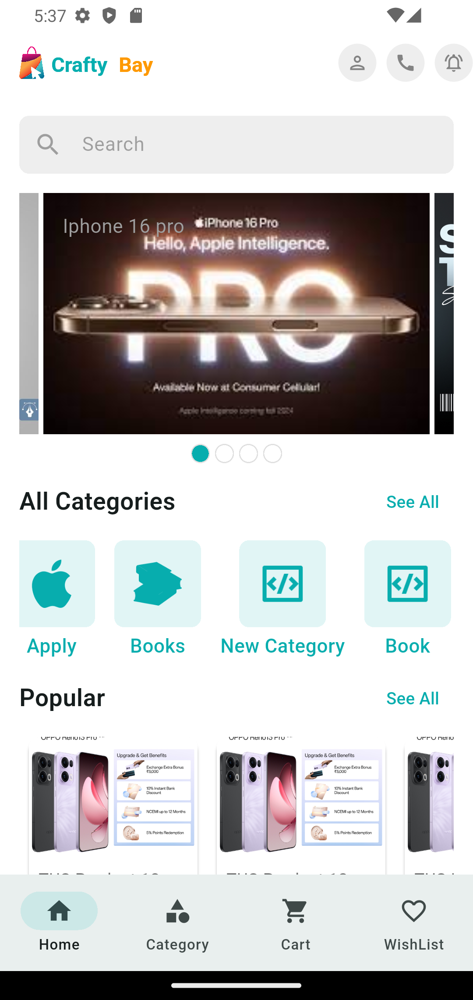 | 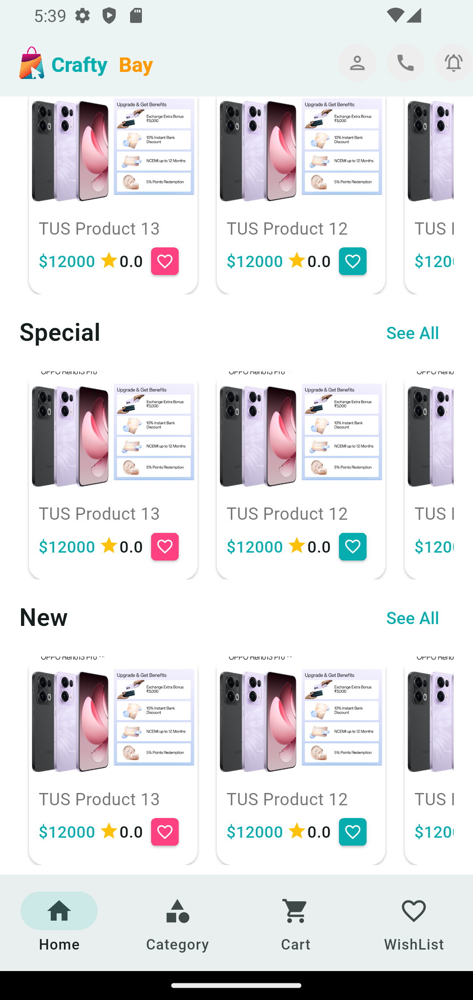 | 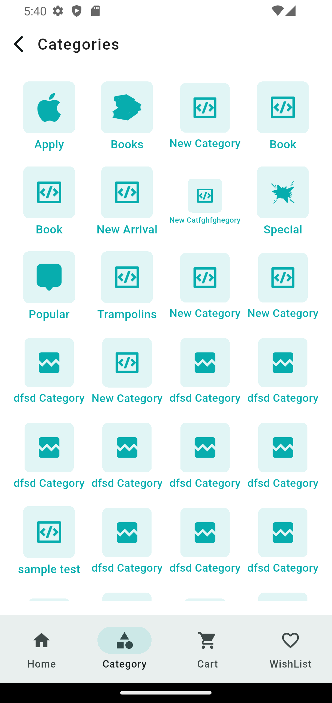 | 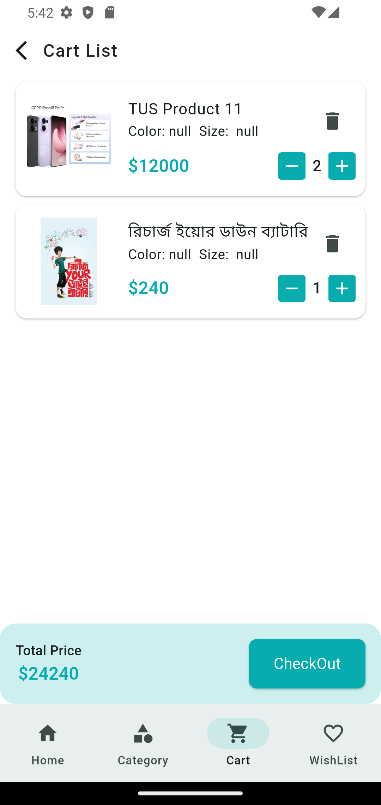 | 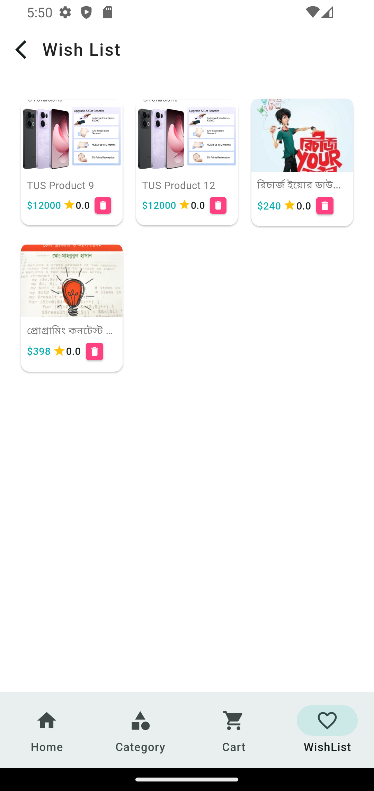 |

---

###  Product Flow
| Category Product List | Product Details |
|----------------------|------------------|
|  | 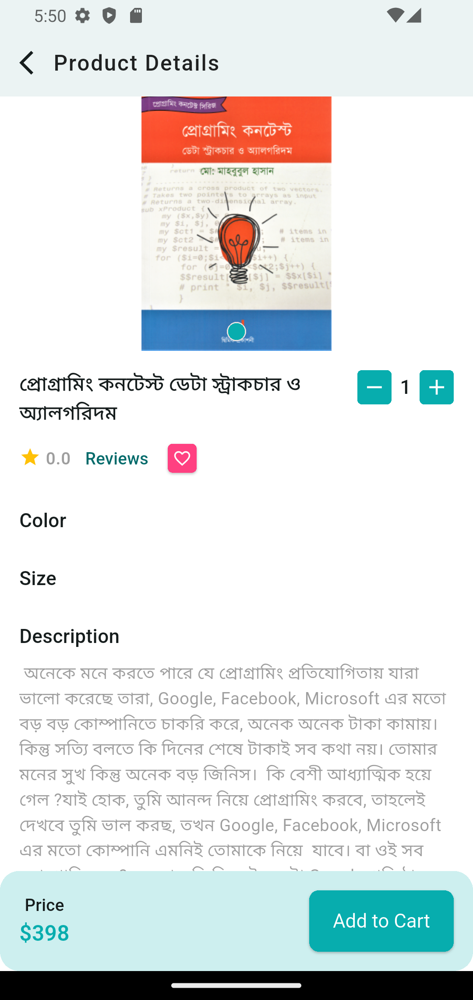 |

---

###  Review Section
| Review List | Create Review |
|-------------|---------------|
| 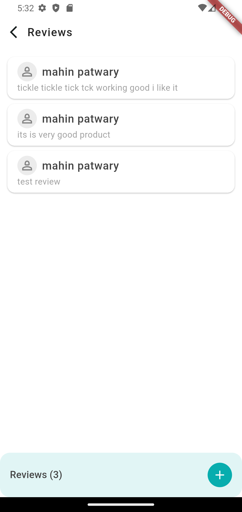 | 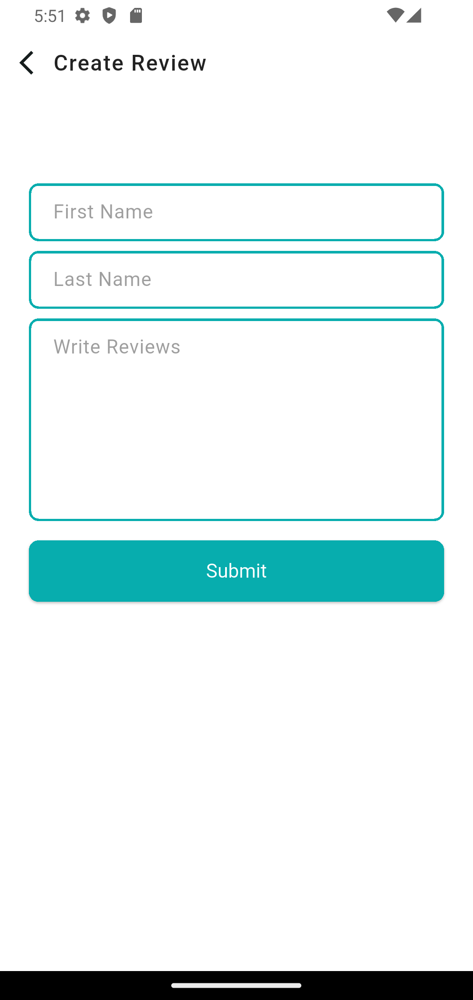 |

---

###  Payment Flow
| Make Payment | Confirm Payment |
|--------------|------------------|
| 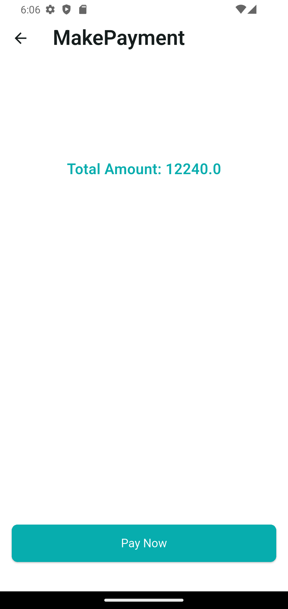 |  |

---

###  Authentication & Onboarding
| Splash Screen | Sign In | Sign Up | OTP Verification |
|---------------|---------|---------|------------------|
| 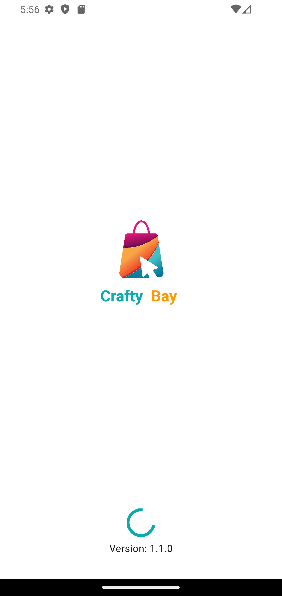 | 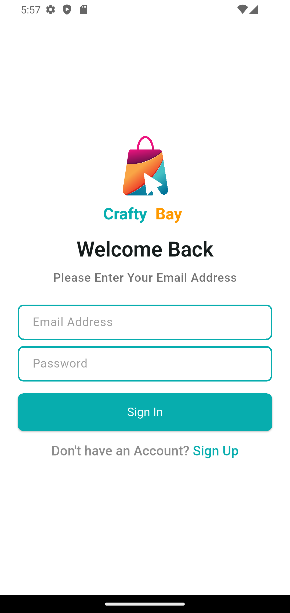 | 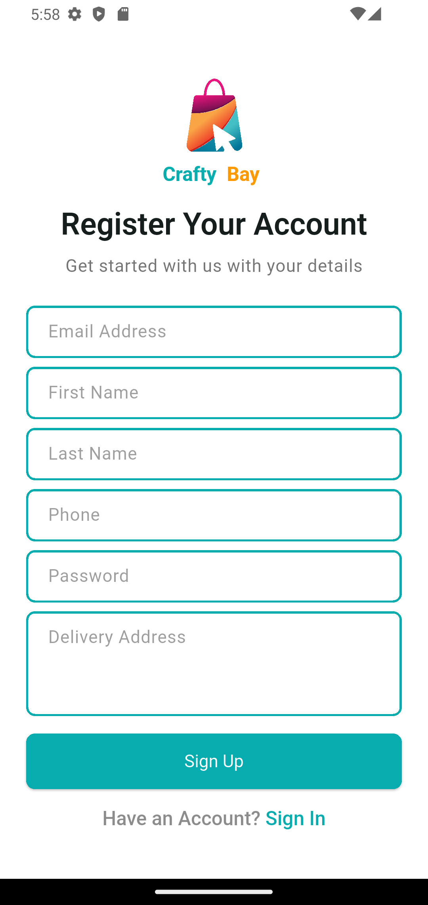 | 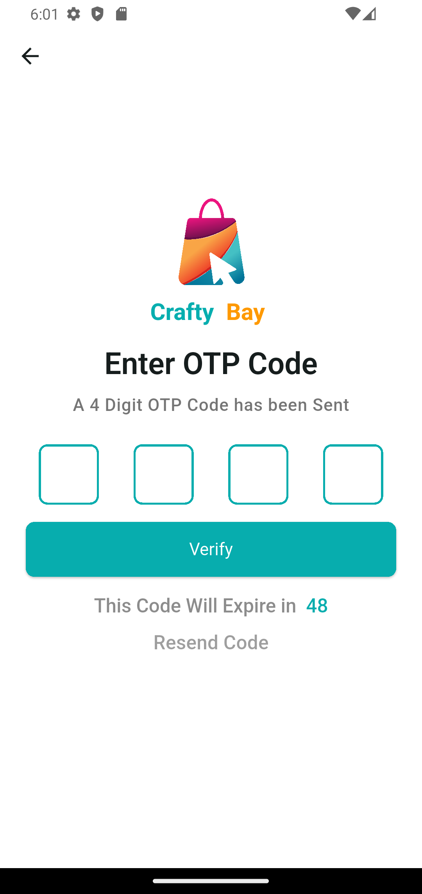 |

---

##  Future Improvements

- Order tracking system
- Admin dashboard panel
- Push notifications (Firebase Messaging)
- Advanced filtering system
- Analytics dashboard

---

##  Tech Stack

- Flutter
- Dart
- GetX
- REST API
- SharedPreferences
- SSLCommerz Payment Gateway
- Firebase Crashlytics
- Localization-ready architecture
- Custom Networking Layer

---

##  Final Note

This App is a production-ready ecommerce mobile application built with real-world architecture principles, API-driven design, and scalable Flutter development practices.

It demonstrates strong understanding of:
- Mobile app architecture
- State management (GetX)
- API integration
- Payment system handling
- Crash monitoring (Crashlytics)
- Localization-ready design
- Modular clean code structure

---

##  Author

  Abdul Aziz Patwary  
  Flutter Developer
